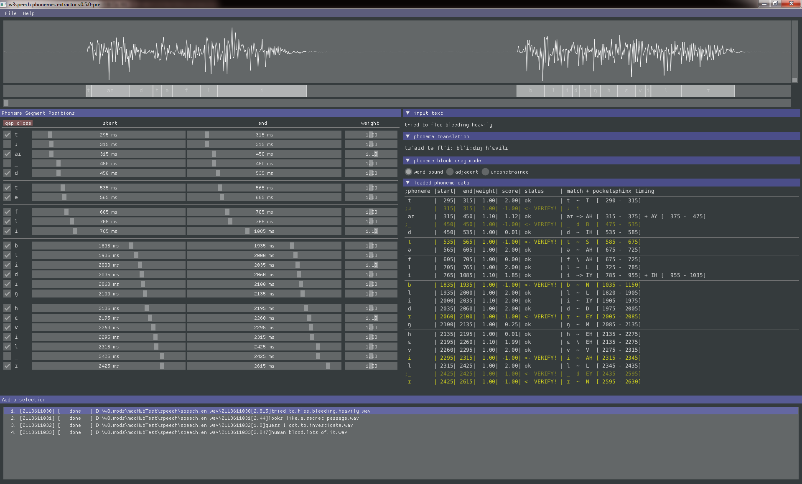

# Witcher 3 Phoneme-Extractor

Utility to the extract and interactively adjust phoneme timings from audio and its transcribed text. Intended to be used as base for generating lipsynced animation for custom voiceover audio for "The Witcher 3: Wild Hunt" game by CD Projekt Red

It also allows generation of uniform phoneme timings based on phoneme translation of text.

The Phoneme-Extractor is part of radish community modding tools.



radish modding tools are a collection of community created modding tools aimed to enable the creation of new quests for "The Witcher 3: Wild Hunt" game by CDPR.

The full package will be available here: https://www.nexusmods.com/witcher3/mods/3620

It will contain precompiled binaries, supporting batch files and HOW-TOs.

## Building from Source

* The project can be compiled with the stable rust-toolchain version 1.36 or higher. Windows platform requires the MSVC toolchain.

* see Cargo.toml for referenced crates

* x86_64-windows precompiled versions of the required 3rd party libraries are included
  * espeak-sys/native/x86_64-windows
  * pocketsphinx-sys/native/x86_64-windows

1. Clone with all submodules:
   ```sh
   $ git clone --recurse-submodules https://codeberg.org/rmemr/w3.phoneme-extractor.git
   ```

2. Build with:
   ```sh
   > cargo build
   ```
   or as release build
   ```sh
   > cargo build --release
   ```

## Starting

Before starting you need to setup
  * the language and phoneme model for pocketsphinx from the pocketsphinx src repository
  * the data for eSpeak from the espeak src package

See instructions in the readme.1st files in the data folder.

In addition VC++ 2015 redistributable package (vc_redist.x64.exe) is required to run the tool. Download from https://www.microsoft.com/en-us/download/details.aspx?id=48145

## Options

```shell
> w3speech-phoneme-extractor --help
w3speech phonemes extractor v0.5.0-pre
This program uses the CMU Pocketsphinx library (https://github.com/cmusphinx/pocketsphinx),
the CMU Sphinx common libraries (https://github.com/cmusphinx/sphinxbase),
the eSpeak Library (http://espeak.sourceforge.net).

Usage: w3speech-phoneme-extractor [options]

Options:
    -h, --help          print this help menu
    -e, --extract DIRECTORY
                        non interactive (batch-mode without gui) extraction of
                        timed phoneme information from <id>*.ogg and <id>*.wav
                        file(s) found in DIRECTORY. results are saved as
                        <id>.phonemes file(s) in DIRECTORY.requires a
                        strings-file with matching text lines for every <id>.
                        if no --strings-file parameter is given the first
                        found csv-file (*.csv|*.strings-csv) in DIRECTORY or
                        its parent directory is used.
    -s, --strings-file FILE.csv
                        csv file with <id>s and their associated text lines.
                        format as described in the GUI help.
        --generate-from-text-only
                        generate phonemes file for every id found in
                        strings-file based solely on the text.
    -a, --audio-dir DIRECTORY
                        defines the starting directory containing audio files
                        (see --extract) to be opened in gui mode. default is
                        current directory. required strings-file will be
                        searched as in batch-mode or can be provided with
                        --strings-file.
    -d, --data-dir DIRECTORY
                        defines data-directory containing pocketsphinx and
                        eSpeak data. default is "./data".
    -w, --worker-threads COUNT
                        defines number of phoneme extracting worker-threads in
                        interactive gui mode. max is 16, default is 1
    -l, --language LANGUAGE
                        language code which defines the used speech/phoneme
                        recognition models and text to phoneme translation.
                        default is "en". NOTE: the code must be supported by
                        eSpeak and CMUSphinx. It will be lowercased and mapped
                        to a data directory "data/pocketsphinx/<LANGUAGE>"
                        which must exist and contain the appropriate
                        pocketsphinx models, see readme.txt in
                        data/pocketsphinx directory.
    -v, --verbose       show debug messages in console
        --very-verbose  show more debug messages in console
```

## License Information

w3speech-phoneme-extractor is free software: you can redistribute it and/or modify it under the terms of the GPL v3+.

It uses third party libraries that are distributed under their own terms:
- CMU Pocketsphinx library
 - Copyright (c) 1999-2016 Carnegie Mellon University.
 - https://github.com/cmusphinx/pocketsphinx
 - BSD-like license (see https://github.com/cmusphinx/pocketsphinx/blob/master/LICENSE)

- CMU Sphinx common libraries
 - Copyright (c) 1999-2016 Carnegie Mellon University.
 - https://github.com/cmusphinx/sphinxbase
 - BSD-like license (see https://github.com/cmusphinx/sphinxbase/blob/master/LICENSE)

- eSpeak Library
 - Copyright (c) 1995-2014 by Jonathan Duddington
 - http://espeak.sourceforge.net
 - GPL v3 (http://espeak.sourceforge.net/license.html)

## Contributing

First: thank you for your interest! There are many ways to contribute. You can write bug reports, create pull requests to fix bugs or add new features or write documentation.

Please make sure your pull requests:
  * reference a ticket, if you want to add a new feature please make a ticket first and outline what you are trying to add
  * is formatted with rustfmt
  * compiles with the current master branch

If you have questions, you can find me on the [nexusmods discord server][nexusmods-discord] in the #the-witcher-3 channel.

[nexusmods-discord]:       https://discord.gg/tJDuqw5
